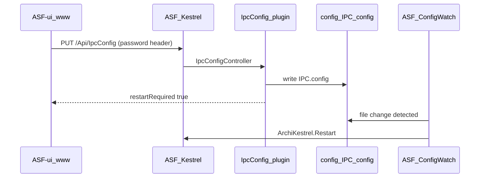

# IpcConfig — documentación técnica

## 1. Problema

El front ASF-ui (compilado en `ASF-BOT/www`) quiere configurar **quién escucha el panel IPC** (localhost vs LAN, puerto, redes conocidas) sin que el usuario copie archivos a mano.

### Qué ya hace el core ASF (sin plugin)

| Operación | API / mecanismo | ¿Suficiente? |
|-----------|-----------------|--------------|
| Leer/escribir `IPCPassword` | `GET/POST /Api/Asf` → `GlobalConfig.IPCPassword` | Sí para contraseña |
| Servir UI | Carpeta `www/` (Kestrel static files) | Sí |
| Configurar bind de Kestrel | Archivo **`config/IPC.config`** (lectura al arranque; ConfigWatch → `ArchiKestrel.Restart`) | No hay API oficial de escritura |

Conclusión: la UI puede **generar** el JSON (`ASF-ui` → `ipc-config.js` + descarga), pero **no puede aplicarlo** en el disco del proceso ASF sin un componente nativo (plugin) o acceso al filesystem fuera del browser.

```text
Browser (ASF-ui)
    │  HTTPS/HTTP al mismo host que el panel
    ▼
ASF Kestrel  (/Api/*, static www/)
    │
    ├── Oficial: GlobalConfig (ASF.json)     ← IPCPassword OK
    └── Oficial: config/IPC.config          ← sin API de escritura
            ▲
            └── Este plugin escribe aquí vía /Api/IpcConfig
                (ConfigWatch → ArchiKestrel.Restart)
```

## 2. Cómo funciona ASF-BOT / ArchiSteamFarm (relevante)

### 2.1 Layout del runtime del usuario

```text
ASF-BOT/                          ← “lo que usa el usuario final”
├── ArchiSteamFarm.exe            ← core oficial (no fork)
├── config/
│   ├── ASF.json                  ← GlobalConfig (IPCPassword, IPC enabled, …)
│   ├── *.json / *.db             ← bots
│   └── IPC.config                ← Kestrel avanzado (opcional)
├── www/                          ← ASF-ui compilado (dist/)
├── plugins/                      ← DLLs de plugins
│   ├── ArchiSteamFarm.OfficialPlugins.*
│   └── IpcConfig/                ← este plugin
└── logs/
```

El browser **nunca** escribe en `config/`. Solo habla HTTP con Kestrel. Por eso hace falta código C# dentro del proceso ASF.

### 2.2 Carga de `IPC.config` (core)

En `ArchiKestrel.CreateWebApplication()` (core ASF):

1. Ruta: `{cwd}/config/IPC.config` (`SharedInfo.ConfigDirectory` + `SharedInfo.IPCConfigFile`).
2. Si **existe**: `ConfigurationBuilder` + `ConfigureKestrel` con sección `Kestrel` (endpoints HTTP/HTTPS, etc.).
3. Si **no existe**: default `ListenLocalhost(1242)`.
4. `KnownNetworks` (sección custom en el JSON) se mapea a `ForwardedHeadersOptions.KnownIPNetworks` — redes de **proxies de confianza** para cabeceras `X-Forwarded-*`, **no** un firewall de “quién puede abrir el panel”.

Implicaciones para el producto:

| Campo en IPC.config | Efecto real |
|---------------------|-------------|
| `Kestrel:Endpoints:…:Url` = `http://127.0.0.1:1242` | Solo este PC |
| `Url` = `http://*:1242` | Escucha en todas las interfaces → LAN puede conectar |
| `Kestrel:KnownNetworks` | Confianza de proxy / forwarded headers |
| `Kestrel:PathBase` | Prefijo URL del IPC |
| Autenticación del panel | **`IPCPassword` en ASF.json**, no en IPC.config |

Cambiar el archivo **en caliente**: con **ConfigWatch** activo (default de ASF), el core detecta el cambio de `IPC.config` y llama a **`ArchiKestrel.Restart()`** (`ASF.OnChangedConfigFile`). No hace falta matar todo el proceso `ArchiSteamFarm.exe` en el caso normal. Si el usuario arrancó con `--no-config-watch`, entonces sí hace falta reiniciar ASF a mano.

### 2.3 Extensión vía plugins

ASF carga DLLs de `plugins/**` con MEF (`[Export(typeof(IPlugin))]`).

Interfaces útiles aquí:

| Interfaz | Uso |
|----------|-----|
| `IPlugin` | Nombre, versión, `OnLoaded` |
| `IWebServiceProvider` | `OnConfiguringServices` / `OnConfiguringEndpoints` |
| Controllers | ASF hace `AddApplicationPart` de los assemblies de plugins activos y `MapControllers()` |

Patrón oficial: controller que hereda `ArchiController`, ruta bajo `/Api/...`, protegido por el mismo middleware `ApiAuthenticationMiddleware` (password IPC) que el resto de la API.

Ejemplo de estilo: `SteamTokenDumperController` → `[Route("Api/SteamTokenDumperPlugin")]`.

`IWebInterface` **no** hace falta para este plugin (no sirve HTML estático propio); la UI sigue en `www/` (ASF-ui).

## 3. Diseño del plugin IpcConfig

### 3.1 Responsabilidad única

**Persistir y devolver** el documento `IPC.config` en disco, con validación defensiva.  
No gestiona bots, no sustituye `ASF.json`, no implementa ACL IP custom.

### 3.2 Endpoints propuestos

Base: `/Api/IpcConfig`  
Auth: igual que `/Api/*` (header/password IPC según configuración ASF).

#### `GET /Api/IpcConfig`

- Si existe `config/IPC.config` → parsea JSON y responde modelo tipado / `JsonNode`.
- Si no existe → responde **defaults efectivos** (equivalente mental a localhost:1242) y `fileExists: false`.
- Nunca expone `IPCPassword`.

Respuesta orientativa (envolver en `GenericResponse<T>` al estilo ASF):

```json
{
  "Success": true,
  "Result": {
    "fileExists": true,
    "path": "config/IPC.config",
    "listenLan": true,
    "port": 1242,
    "pathBase": "/",
    "knownNetworks": ["10.0.0.0/8", "172.16.0.0/12", "192.168.0.0/16"],
    "raw": { "Kestrel": { "...": "..." } },
    "restartRequired": false
  }
}
```

#### `PUT /Api/IpcConfig` (o `POST`)

Body alineado con lo que ya construye ASF-ui (`buildIpcConfig` en `ipc-config.js`):

```json
{
  "listenLan": true,
  "port": 1242,
  "pathBase": "/",
  "knownNetworks": ["192.168.1.20/32"]
}
```

Comportamiento:

1. Validar puerto `1–65535`, CIDRs, `pathBase`.
2. Serializar al formato Kestrel que ASF espera (mismo shape que genera el front hoy).
3. Escribir atómicamente: temp file en `config/` + replace → `IPC.config`.
4. Loguear en `ASF.ArchiLogger`.
5. Responder `restartRequired: true` como señal UX (con ConfigWatch, Kestrel se reinicia solo).
6. No hace falta matar el proceso salvo `--no-config-watch`; DELETE puede aceptar `?restart=true` opcional.

#### `DELETE /Api/IpcConfig` (opcional)

Elimina el archivo para volver al default `ListenLocalhost(1242)` tras reinicio.

### 3.3 Contrato con ASF-ui `/configuration`

Hoy la página:

1. Guarda password → `POST /Api/Asf`.
2. Descarga JSON → usuario copia a `/config`.

Con el plugin:

1. Guarda password → igual.
2. **`PUT /Api/IpcConfig`** con el mismo payload que hoy se descarga.
3. UI muestra “reinicia ASF” (ya documentado en el checklist).
4. Fallback: si `404` / plugin ausente → mantener descarga manual (graceful degradation).

Detección: `GET /Api/IpcConfig` o listar plugins (`GET /Api/Plugins`) buscando nombre `IpcConfig`.

### 3.4 Seguridad

- Hereda autenticación IPC: sin password (o con password incorrecto) → mismo 401/403 que el resto de `/Api`.
- Validar path: **solo** escribir dentro de `SharedInfo.ConfigDirectory` + nombre fijo `IPC.config` (nunca path del cliente).
- Rechazar JSON con propiedades inesperadas peligrosas si se acepta `raw` (preferir DTO tipado).
- Advertir en docs: `listenLan: true` sin password es configuración insegura; el plugin puede **exigir** que exista `IPCPassword` cuando `Url` no sea loopback (alineado a la UI).

### 3.5 Estructura de proyecto (esqueleto)

```text
ASF-Plugin/IpcConfig/
├── README.md                 ← resumen + instalación ASF-BOT
├── TECHNICAL.md              ← este documento
└── src/
    ├── IpcConfig.csproj      ← (cuando se cablee Template / refs ASF)
    ├── IpcConfigPlugin.cs    ← IPlugin + IWebServiceProvider
    ├── Controllers/
    │   └── IpcConfigController.cs
    ├── Models/
    │   ├── IpcConfigDto.cs
    │   └── IpcConfigStatusResponse.cs
    └── Services/
        └── IpcConfigFileService.cs   ← read/write/validate
```

Compilación: referenciar assemblies ASF del SDK/template (no copiar el exe del usuario). Publicar ZIP → `plugins/IpcConfig/`.

## 4. Flujo end-to-end (usuario final)



## 5. Limitaciones honestas

1. **Si ConfigWatch está desactivado**, el bind no cambia hasta reiniciar ASF.
2. **KnownNetworks ≠ lista blanca de clientes**; la UI debe seguir explicando “LAN abierta + password”.
3. Auto-update del **exe** oficial no borra `plugins/` ni `config/` en el flujo normal de ASF, pero un update agresivo de `www/` puede pisar la UI: el plugin DLL permanece.
4. Versionado: recompilar el plugin cuando cambie la API pública de ASF / TFM.
5. `SharedInfo.IPCConfigFile` es **internal** en el core: el plugin usa el literal `"IPC.config"`.

## 6. Alternativas descartadas (y por qué)

| Alternativa | Por qué no |
|-------------|------------|
| Solo front en `www/` | Browser sin FS sobre `config/` |
| Modificar core ASF / fork exe | Rompe auto-update y política Yeremi (“core oficial”) |
| Script externo PowerShell en el PC | No integrado en el panel; peor UX |
| Servir IPC.config desde static `www/` | ASF no lo lee desde ahí |

## 7. Estado de implementación en este repo

- Documentación + contrato + código C# **compilable**.
- Build local: `ASF-Plugin/IpcConfig/src/build.ps1` → `ASF-BOT/plugins/IpcConfig/`.
- ASF-ui `/configuration` cableado (detectar / aplicar / aviso si falta).
- Release ZIP en GitHub + CI con PluginTemplate: pendiente de publicar el primer asset `IpcConfig.zip`.

## 8. Primera instalación vs update (como ASF)

| Situación | Qué puede hacer el panel |
|-----------|--------------------------|
| Plugin **no** instalado | Aviso + enlace a Releases + reinicio. **No** puede escribir en `plugins/` (ASF no expone API de instalación arbitraria). |
| Plugin **sí** cargado | `PUT /Api/IpcConfig` aplica red. `IGitHubPluginUpdates` permite `POST /Api/Plugins/Update` para versiones nuevas del ZIP. |

## 9. Referencias de código (core local)

- `ArchiSteamFarm/IPC/ArchiKestrel.cs` — carga `IPC.config`, `KnownNetworks`, `MapControllers`, `AddApplicationPart`
- `ArchiSteamFarm/Plugins/Interfaces/IWebServiceProvider.cs`
- `ArchiSteamFarm/IPC/Controllers/Api/ArchiController.cs`
- `ArchiSteamFarm.OfficialPlugins.SteamTokenDumper/SteamTokenDumperController.cs` — ejemplo de controller de plugin
- `ASF-ui/src/utils/ipc-config.js` — builder JSON ya alineado con el formato esperado
- `ASF-ui/src/views/Configuration.vue` — detecta plugin, aplica o avisa / descarga
